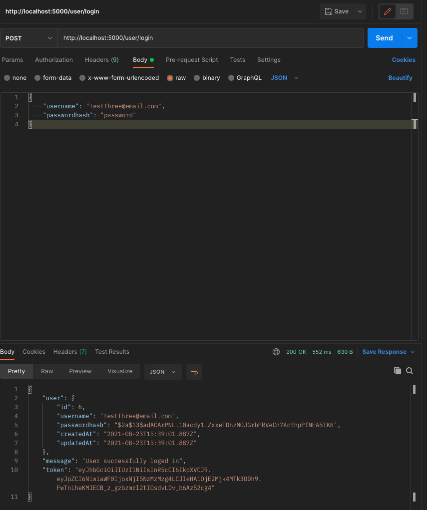
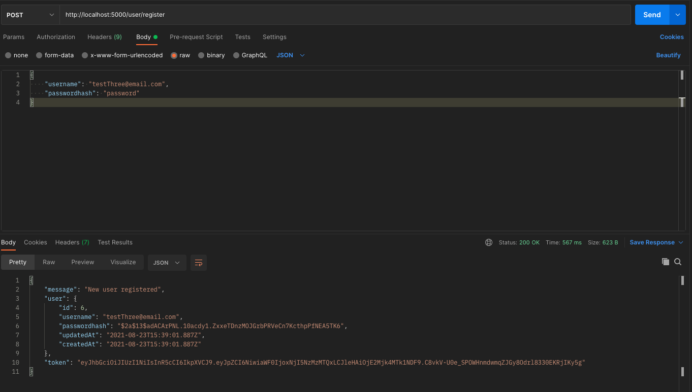
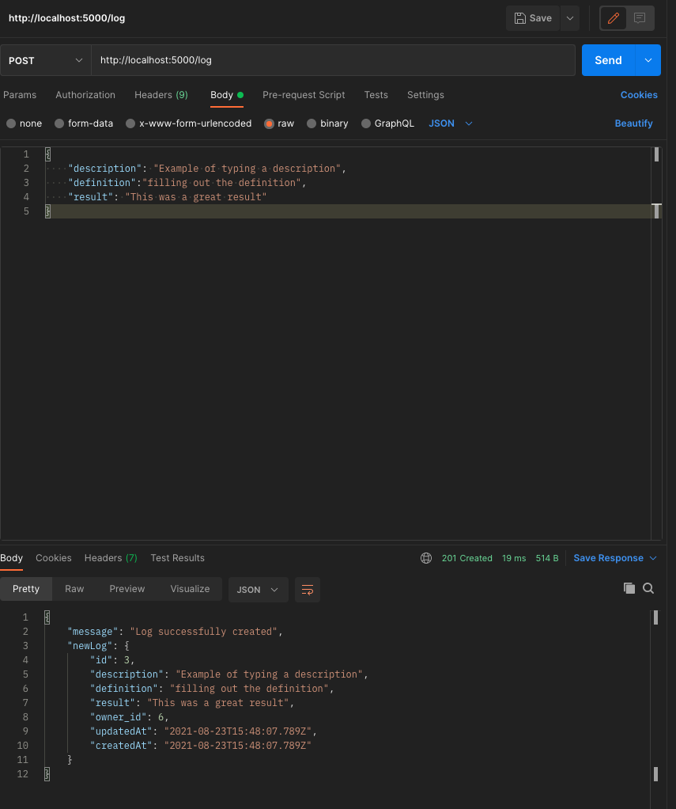
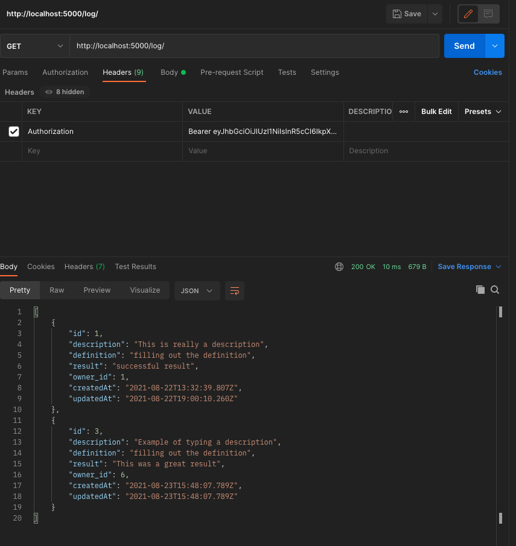
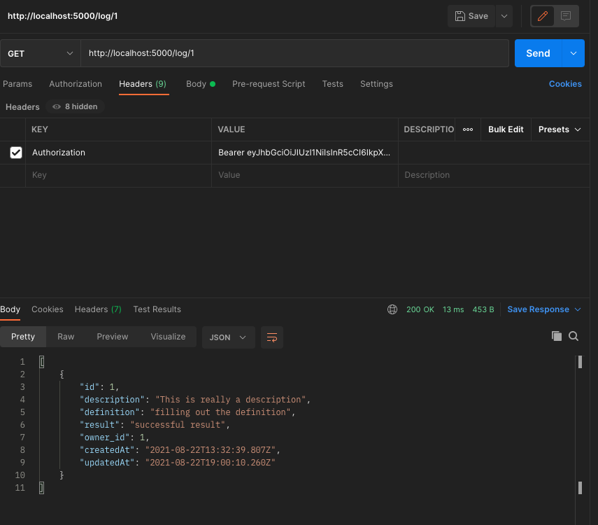
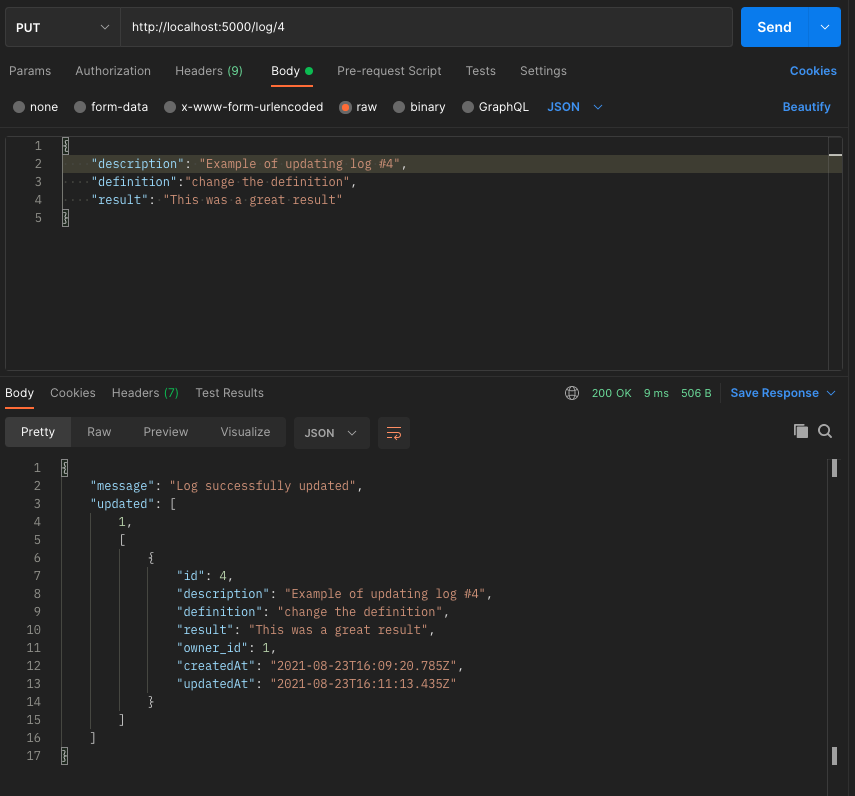
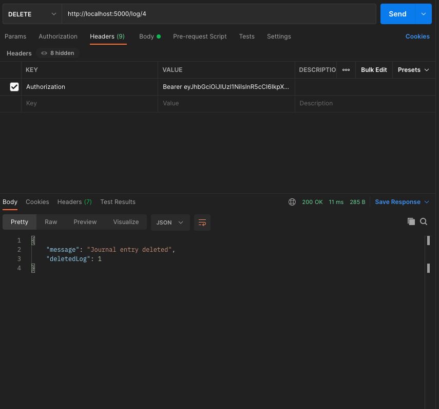

# Workout Log Server

[Eleven Fifty Academy](https://elevenfifty.org/) assignment to demonstrate skill and proficiency building a server with [ExpressJS](https://expressjs.com/).

## Major Criteria

The server must do the following:

- Follow the [MVC](https://developer.mozilla.org/en-US/docs/Glossary/MVC) pattern;

- Have User Authenication;

- Persist data to Postgres using Sequelize;

- keys concepts involving `jwt`, `bcrypt` and `middleware`.

## Required Endpoints

| Endpoint       | Verb   | Description                                                                                         |
| -------------- | ------ | --------------------------------------------------------------------------------------------------- |
| /user/register | POST   | Allows a new user to be created with a username and password.                                       |
| /user/login    | POST   | Allows log in with an existing user.                                                                |
| /log/          | POST   | Allows users to create a workout log with descriptions, definitions, results, and owner properties. |
| /log/          | GET    | Gets all logs for an individual user.                                                               |
| /log/:id       | GET    | Gets individual logs by `id` for an individual user.                                                |
| /log/:id       | PUT    | Allows individual logs to be updated by a user.                                                     |
| /log/:id       | DELETE | Allows individual logs to be deleted by a user.                                                     |

## Data Models

`user.js`

| Property     | Type   |
| ------------ | ------ |
| username     | STRING |
| passwordhash | STRING |

`log.js`

| Property    | Type    |
| ----------- | ------- |
| description | STRING  |
| definition  | STRING  |
| result      | STRING  |
| owner_id    | INTEGER |

_The `owner_id` must come from the `validateSession` middleware function._

## Endpoints Tested

Below are [Postman](https://www.postman.com/) screenshots showing successful HTTP method (POST, PUT, GET, DELETE) requests to the server

| **/user/register** | **POST** |
| ------------------ | -------- |

| **/user/login** | **POST** |
| --------------- | -------- |

| **/log/** | **POST** |
| --------- | -------- |

| **/log/** | **GET** |
| --------- | ------- |

| **/log/:id** | **GET** |
| ------------ | ------- |

| **/log/:id** | **PUT** |
| ------------ | ------- |

| **/log/:id** | **DELETE** |
| ------------ | ---------- |

